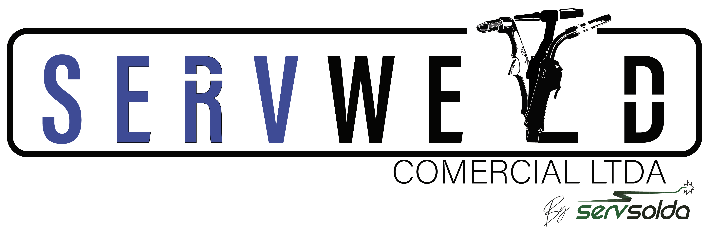

# Servweld - Alta Performance em Soldagem e Corte



Este é o repositório oficial do novo website da **Servweld**, desenvolvido com as tecnologias mais modernas do ecossistema web para oferecer uma experiência premium, rápida e totalmente gerenciável.

## 🚀 Tecnologias Utilizadas

- **Core:** [React 18](https://reactjs.org/) + [Vite](https://vitejs.dev/) (Build ultra-rápido)
- **Estilização:** [Tailwind CSS](https://tailwindcss.com/) (Design moderno e responsivo)
- **Animações:** [Framer Motion](https://www.framer.com/motion/) (Micro-interações e transições fluidas)
- **Backend & Database:** [Supabase](https://supabase.com/) (PostgreSQL, Auth, Storage e RLS)
- **Ícones:** [Lucide React](https://lucide.dev/)
- **SEO:** React Helmet Async para indexação otimizada

## ✨ Funcionalidades Principais

### 🛠️ Painel Administrativo (CRM Customizado)
Um sistema completo de gestão interna que permite ao administrador controlar todo o conteúdo do site sem tocar no código:
- **Gestão de Equipamentos:** Cadastro, edição e exclusão de máquinas para locação.
- **Gestão de Fabricantes:** Controle das marcas parceiras e links de assistência técnica.
- **Portal de Configurações:** Alteração dinâmica de textos e mídias da Home Page.
- **Gestão de Time:** Controle de usuários administrativos.

### 📸 Galeria Dinâmica (Quem Somos)
- Sistema de upload múltiplo de imagens integrado ao Supabase Storage.
- Carrossel infinito na página de contato com efeito de lightbox (expansão de imagem).
- Gerenciamento total via painel admin (Adicionar/Remover fotos).

### ⚙️ Catálogo de Locação & Assistência
- Listagem inteligente de produtos com filtros por categoria.
- Showcase de marcas parceiras com integração direta para suporte.
- Sincronização em tempo real com o banco de dados.

### 📱 Experiência do Usuário (UX/UI)
- **100% Responsivo:** Adaptado para Desktop, Tablet e Mobile.
- **SEO Otimizado:** Meta tags dinâmicas e estrutura semântica.
- **Alta Performance:** Carregamento otimizado de imagens e scripts.

## 🛠️ Configuração do Projeto

1. Instale as dependências:
   ```bash
   npm install
   ```

2. Configure as variáveis de ambiente no arquivo `.env`:
   ```env
   VITE_SUPABASE_URL=sua_url_do_supabase
   VITE_SUPABASE_ANON_KEY=sua_chave_anon_do_supabase
   ```

3. Inicie o servidor de desenvolvimento:
   ```bash
   npm run dev
   ```

---

**Desenvolvido por:** [Fernando_M_Aragao](https://github.com/fernandoapaiva-dotcom)
